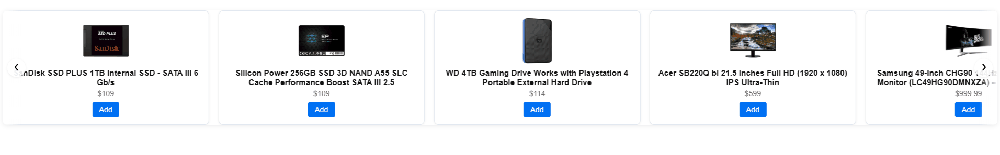

<p align="center">
  
</p>

<h1 align="center">Embeddable E-commerce Widget</h1>

<p align="center">
  🚀 Lightweight, Fast, and Modern JavaScript Widget for Embedding Products into Any Website
</p>

---

# 📦 Project Overview

This project is a fully embeddable **e-commerce widget** that allows you to:

- ✅ Show 5 products per viewport  
- ✅ Scroll left/right with Prev/Next buttons  
- ✅ Infinite looping behavior  
- ✅ Fully responsive (desktop, tablet, mobile)  
- ✅ Pure **Vanilla JavaScript** (no frameworks)  
- ✅ Easily integrate into **any** website with one line of code  
- ✅ Host the widget yourself or through a CDN  

---

# 🎯 Features

| Feature                         | Status |
|---------------------------------|:------:|
| Responsive Design               | ✅ |
| Horizontal Carousel with Scroll | ✅ |
| 5 Items Per Viewport            | ✅ |
| Infinite Looping                | ✅ |
| Lightweight & Fast              | ✅ |
| Shadow DOM Isolation            | ✅ |
| No External Dependencies        | ✅ |

---

# 🚀 Quick Start

### 1️⃣ Clone the repository

```bash
git clone https://github.com/your-username/your-widget-repo.git
cd your-widget-repo
```

### 2️⃣ Install dependencies

```bash
npm install
```

### 3️⃣ Start development server (Vite + HMR)

```bash
npm run dev
```

> Opens <http://localhost:5173> with live reload.

### 4️⃣ Build for production

```bash
npm run build
```

> Outputs bundled `widget.min.js` to `dist/`

### 5️⃣ Preview production build

```bash
npx serve .
```

> Serves `widget.min.js` in the preview.html available here: <http://localhost:3000/preview>

---

# 🛠 Usage Example

Paste this into **any** HTML page:

```html
<div id="my-ecom-widget"></div>

<script src="https://your-cdn.com/widget.min.js"></script>
<script>
  window.EcomWidget.init({
    selector: '#my-ecom-widget',
    category: 'electronics'    // optional: API category
  });
</script>
```

✅ That's it! Your widget is now live and running inside any webpage.

---

# ✨ Widget Preview


---

# ⚙️ Configuration Options

| Property      | Type     | Default            | Description                              |
| ------------- | -------- | ------------------ | ---------------------------------------- |
| `selector`    | `string` | `#my-ecom-widget`  | CSS selector where the widget mounts     |
| `category`    | `string` | `'electronics'`    | Fake Store API category to fetch         |
| `visibleCount`| `number` | `5`                | Number of cards visible per viewport     |

Example:

```js
window.EcomWidget.init({
  selector: '#your-div-id',
  category: 'jewelery',
  visibleCount: 5
});
```

---

# 📡 API Endpoints Used

- **GET** products by category:  
  `https://fakestoreapi.com/products/category/{category}`  
- **POST** add to cart:  
  `https://fakestoreapi.com/carts`

*(Free public test API — no API key required.)*

---

# 🧩 Technology Stack

- Pure **Vanilla JavaScript** (ES6+)  
- **HTML + CSS** inside **Shadow DOM** for isolation  
- **Vite** for development & bundling (IIFE output)  
- Zero runtime dependencies  

---

# 📁 Project Structure

```
your-widget-repo/
├── widget.js            # Main widget source
├── vite.config.js       # Vite config for dev & build
├── package.json         # npm scripts & dependencies
├── .gitignore           # Ignored files (node_modules, dist, etc.)
└── dist/                # Production build output (widget.js)
```

**.gitignore** example:

```gitignore
node_modules/
dist/
.env
.DS_Store
.vscode/
```

---

# 📜 License

**MIT License**

You are free to use, modify, distribute, and contribute!

---

# 🤝 Contributing

Pull requests are very welcome!  
For major changes, please open an issue first to discuss.

1. Fork the repo  
2. Create a branch (`git checkout -b feature/...`)  
3. Commit your changes (`git commit -m "feat: ..."`)  
4. Push (`git push origin feature/...`)  
5. Open a Pull Request  

---

# 📬 Contact

If you like this project, feel free to connect:

- 🌐 [LinkedIn](https://www.linkedin.com/in/oliver-t-8a28b070/)  
- 🐦 [GitHub](https://github.com/SchnapsterDog)  
- 📩 Email: oliver@akrinum.com  

---

<p align="center">Made with ❤️ and JavaScript</p>
